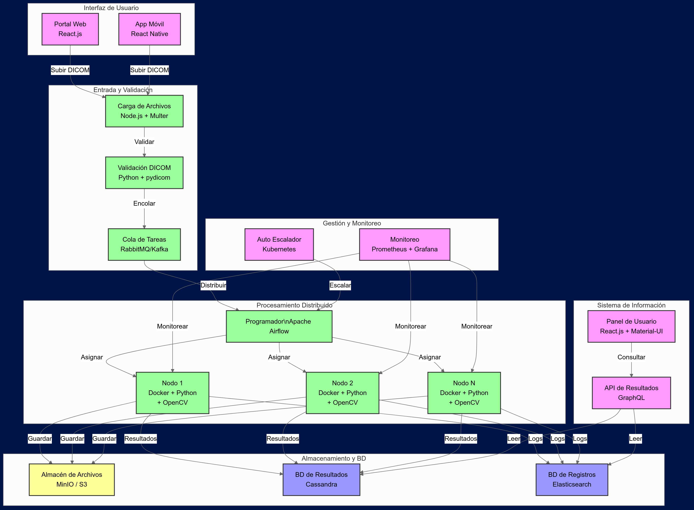

# Test Python ImeXHS

Este repositorio contiene el código desarrollado como parte de la prueba técnica para imeXHS. El objetivo principal es demostrar habilidades en Python a través de varios ejercicios que abarcan desde el manejo de archivos hasta la creación de una API RESTful para la gestión de resultados de procesamiento de imágenes médicas.

## Sugerencias

Suguiero que para este proyecto se cree un entorno virtual para mantener las dependencias aisladas y facilitar la ejecución del proyecto. Para ello, puedes utilizar venv, el entorno virtual integrado de Python

## Creación y Activación del Entorno Virtual

   ```bash
    python -m venv venv
    source venv/bin/activate  # Para Linux/MacOS
    venv\Scripts\activate  # Para Windows

   ```

## Instalación de Dependencias

Con el entorno virtual activado, instala las dependencias necesarias ejecutando:

   ```bash
    pip install -r requirements.txt

   ```
ya que esto garantizará que todos los paquetes requeridos estén instalados correctamente.

# Punto 1 - Manejo de Archivos y Operaciones con Arreglos

En esta sección, se desarrollan funciones para trabajar con archivos y directorios. Estas funciones permiten listar el contenido de carpetas, leer archivos CSV y DICOM, y calcular estadísticas básicas.

## Scripts Incluidos

- list_folder.py: Función para listar el contenido de una carpeta y contar el número de elementos.
- csv_operations.py: Función para leer archivos CSV, contar columnas y filas, y calcular estadísticas como la media y la desviación estándar para columnas numéricas.
- dicom_operations.py: Función para leer archivos DICOM e imprimir detalles específicos como el nombre del paciente, la fecha del estudio y la modalidad.

## Ejemplo de Uso

   ```bash
    python main.py 1 file_operations 
    python main.py 2 file_operations sample-01-csv.csv  
    python main.py 3 file_operations sample-01-dicom.dcm 0x0008 0x0016 

   ```
 
# Punto 2 - Programación Orientada a Objetos (OOP)

Aquí se implementan clases para modelar registros de pacientes y estudios médicos, utilizando conceptos de programación orientada a objetos.

## Clases Desarrolladas

- PatientRecord: Clase que almacena la información básica del paciente.
- StudyRecord: Clase que hereda de PatientRecord y añade detalles específicos del estudio.
- Diagnosis: Clase que extiende PatientRecord para incluir la funcionalidad de actualizar diagnósticos.

## Ejemplo de Uso

   ```bash
    python main.py 4 .\oop\sample-02-dicom.dcm

   ```

# Punto 3 - Multithreading y Concurrencia

En este punto, se desarrollan scripts que utilizan hilos para realizar tareas concurrentes, como imprimir números pares e impares, y procesar datos en paralelo a partir de un archivo JSON.

## Scripts Incluidos
- even_odd_threads.py: Script que utiliza hilos para imprimir números pares e impares entre 1 y 200.
- json_processor.py: Script que lee un archivo JSON, normaliza los datos y procesa cada entrada en hilos separados, con un límite de 4 hilos activos al mismo tiempo.

## Ejemplo de Uso

   ```bash
    python main.py 5 .\multithreading\sample-03-00-json.json   
    python main.py 6 .\multithreading\sample-03-00-json.json

   ```

# Punto 4 - API RESTful para Procesamiento de Imágenes Médicas

Este módulo implementa una API RESTful utilizando Django y Django REST Framework para gestionar los resultados del procesamiento de imágenes médicas. La API soporta operaciones CRUD (Crear, Leer, Actualizar, Eliminar) sobre los resultados, que se almacenan en una base de datos PostgreSQL.

## Configuración Inicial

Para iniciar la API, asegúrate de haber configurado correctamente la base de datos en settings.py. Si PostgreSQL no está disponible, la API utilizará SQLite como base de datos.

## Migraciones de Base de Datos

Antes de iniciar el servidor, aplica las migraciones para crear las tablas necesarias en la base de datos:

   ```bash
    python manage.py migrate
   ```

## Población de Datos

Puedes poblar la base de datos con registros de ejemplo utilizando el script populate_data.py:

   ```bash
    python medical_images_api/populate_data.py
   ```

## Ejecución del Servidor

Inicia el servidor de desarrollo de Django:

   ```bash
    python manage.py runserver
   ```

   La API estará disponible en http://localhost:8000/api/.

# 5. Sistema Distribuido de Procesamiento de DICOM (Diseño y Arquitectura)



Este diseño para un Sistema Distribuido de Procesamiento de DICOM se basa en una arquitectura de microservicios, lo cual permite una mayor flexibilidad, escalabilidad y resistencia a fallos. 

## Explicacion: 

## 1. Interfaz de Usuario:
Optamos por React.js para el portal web y React Native para la aplicación móvil. Esta elección permite compartir gran parte del código entre plataformas, reduciendo el tiempo de desarrollo y mantenimiento. React.js ofrece un rendimiento óptimo para aplicaciones web complejas, mientras que React Native nos da la capacidad de crear una experiencia nativa en dispositivos móviles.
## 2. Entrada y Validación:
Para la carga de archivos, después de comparar varias alternativas opté por Node.js con Multer debido a su eficiencia en operaciones de E/S no bloqueantes. Esto es crucial para manejar múltiples cargas simultáneas sin degradar el rendimiento del sistema.

La validación de archivos DICOM se realiza con Python y pydicom. Ya que, python es ideal para este tipo de tareas debido a su amplia gama de bibliotecas científicas y de procesamiento de imágenes. Mientras pydicom, en particular, está optimizado para trabajar con el formato DICOM.

Es necesario la Implementación de una cola de tareas con RabbitMQ o Kafka para desacoplar la recepción de archivos de su procesamiento. Esto es muy ventajoso ya que permite manejar picos de carga y asegurar que ningún trabajo se pierda en caso de fallos del sistema.

## 3. Procesamiento Distribuido:
Apache Airflow se utiliza como orquestador de tareas debido a su capacidad para manejar flujos de trabajo complejos y su flexibilidad para programar y monitorear tareas.
Los nodos de trabajo se implementan en contenedores Docker, lo que proporciona un entorno consistente y fácilmente replicable. Utilizamos Python con OpenCV para el procesamiento de imágenes debido a su eficiencia y la amplia gama de algoritmos de visión por computadora disponibles.

## 4. Almacenamiento y Bases de Datos:
Para el almacenamiento de archivos, una de las opciones más adecuada es MinIO o Amazon S3, ya que ofrecen alta durabilidad y escalabilidad para grandes volúmenes de datos no estructurados.

-	Cassandra se utiliza como base de datos de resultados debido a su capacidad para manejar grandes volúmenes de escrituras y lecturas con baja latencia, crucial para un sistema que procesa constantemente nuevas imágenes.

-	Elasticsearch se emplea para el almacenamiento de logs, ya que proporciona capacidades de búsqueda y análisis en tiempo real, esenciales para el monitoreo y la resolución de problemas en un sistema distribuido.


## 5. Gestión y Monitoreo:
Kubernetes se utiliza para el auto-escalado, permitiéndonos ajustar dinámicamente la capacidad del sistema en función de la demanda.
La combinación de Prometheus y Grafana proporciona un sistema robusto de monitoreo y visualización, crucial para mantener la salud del sistema y identificar cuellos de botella.

## 6. Sistema de Información:
El panel de usuario se implementa con React.js y Material-UI, ofreciendo una interfaz moderna y responsive.

GraphQL se utiliza para la API de resultados, permitiendo consultas flexibles y eficientes, reduciendo el over-fetching y under-fetching de datos.

La interconexión entre estos componentes es pensada para minimizar la latencia y maximizar el throughput. Por ejemplo, la comunicación entre servicios utiliza gRPC para las operaciones internas de baja latencia, mientras que REST se emplea para las APIs externas, proporcionando una interfaz familiar para integraciones de terceros.

Esta arquitectura permite procesar grandes volúmenes de imágenes DICOM de manera eficiente y escalable, manteniendo la flexibilidad para futuras expansiones o modificaciones del sistema.

# Consideraciones Adicionales:

## 1. Seguridad y privacidad de los datos médicos (cumplimiento HIPAA/GDPR):
Para asegurar la seguridad y privacidad de los datos médicos, se puede implementar las siguientes medidas:

### a) Control de acceso:

- Autenticación multifactor (MFA) para todos los usuarios.
- Implementación de un sistema de control de acceso basado en roles (RBAC).
- Uso de JSON Web Tokens (JWT) para gestionar sesiones de manera segura.


### b) Anonimización de datos:

- Implementación de un proceso de anonimización para eliminar información de identificación personal (PII) de las imágenes DICOM antes del procesamiento.
- Uso de identificadores únicos generados aleatoriamente para vincular imágenes con pacientes sin exponer información personal.

### c) Auditoría y trazabilidad:

- Registro detallado de todas las acciones realizadas en el sistema, incluyendo accesos, modificaciones y eliminaciones de datos.
- Implementación de un sistema de auditoría inmutable para cumplir con los requisitos de HIPAA y GDPR.


### d) Políticas y procedimientos:

- Desarrollo e implementación de políticas de seguridad y privacidad alineadas con HIPAA y GDPR.
- Capacitación regular del personal en prácticas de seguridad y privacidad.


## 2. Métodos de encriptación para transmisión y almacenamiento de datos:

### a) Encriptación en tránsito:

- Uso de TLS 1.3 para todas las comunicaciones en la red.
- Implementación de Perfect Forward Secrecy (PFS) para proteger las comunicaciones pasadas en caso de compromiso de claves.


### b) Encriptación en reposo:

- Encriptación a nivel de disco utilizando AES-256 para todos los servidores y dispositivos de almacenamiento.
- Encriptación a nivel de objeto en el almacenamiento S3 o MinIO, utilizando encriptación del lado del servidor (SSE) con claves gestionadas por el cliente (CMK).


### c) Gestión de claves:

- Utilización de un sistema de gestión de claves (KMS) como AWS KMS o HashiCorp Vault para el manejo seguro de claves de encriptación.
- Rotación regular de claves de encriptación según las mejores prácticas de la industria.


## 3. Implementación de logging para monitoreo del sistema:


Se puede implementar un sistema de logging centralizado utilizando la pila ELK (Elasticsearch, Logstash, Kibana) junto con Fluentd para la recolección de logs:

### a) Recolección de logs:

- Uso de Fluentd en cada componente del sistema para recopilar logs de manera uniforme.
- Configuración de agentes de Filebeat en servidores para recopilar logs del sistema operativo.


### b) Procesamiento y almacenamiento:

- Uso de Logstash para procesar y enriquecer los logs recopilados.
- Almacenamiento de logs en Elasticsearch para búsqueda y análisis eficientes.


### c) Visualización y alertas:

- Configuración de dashboards en Kibana para monitorear la salud y el estado de cada componente.
- Implementación de alertas basadas en umbrales predefinidos utilizando Elasticsearch Watcher o Grafana Alerting.


### d) Retención y archivado:

- Configuración de políticas de retención de logs según los requisitos legales y operativos.
- Implementación de un sistema de archivado a largo plazo para logs históricos.


## 4. Manejo de errores y tiempos de inactividad:


Para mantener la disponibilidad general del sistema ante errores o tiempos de inactividad en servidores individuales, implementaremos las siguientes estrategias:

### a) Arquitectura de alta disponibilidad:

- Despliegue de componentes críticos en múltiples zonas de disponibilidad.
- Implementación de balanceadores de carga para distribuir el tráfico entre instancias saludables.


### b) Monitoreo y auto-reparación:

- Uso de Kubernetes para la orquestación de contenedores, permitiendo la auto-reparación de pods fallidos.
- Implementación de health checks y readiness probes para detectar y aislar instancias no saludables.


### c) Circuit Breakers y Retries:

- Implementación de patrones de Circuit Breaker utilizando bibliotecas como Hystrix o Resilience4j para prevenir la propagación de fallos.
- Configuración de políticas de reintento con backoff exponencial para manejar fallos transitorios.


### d) Colas de mensajes persistentes:

- Uso de RabbitMQ o Kafka con configuraciones de alta disponibilidad para asegurar que los mensajes no se pierdan durante los tiempos de inactividad.


### e) Bases de datos distribuidas:

- Configuración de Cassandra en modo multi-nodo para asegurar la disponibilidad de datos incluso si algunos nodos fallan.
- Implementación de sharding y replicación en Elasticsearch para distribuir la carga y mantener copias redundantes de los datos.


### f) Planes de recuperación ante desastres:

- Desarrollo e implementación de planes de recuperación ante desastres (DRP) detallados.
- Realización de simulacros regulares de recuperación ante desastres para validar la efectividad de los planes.
